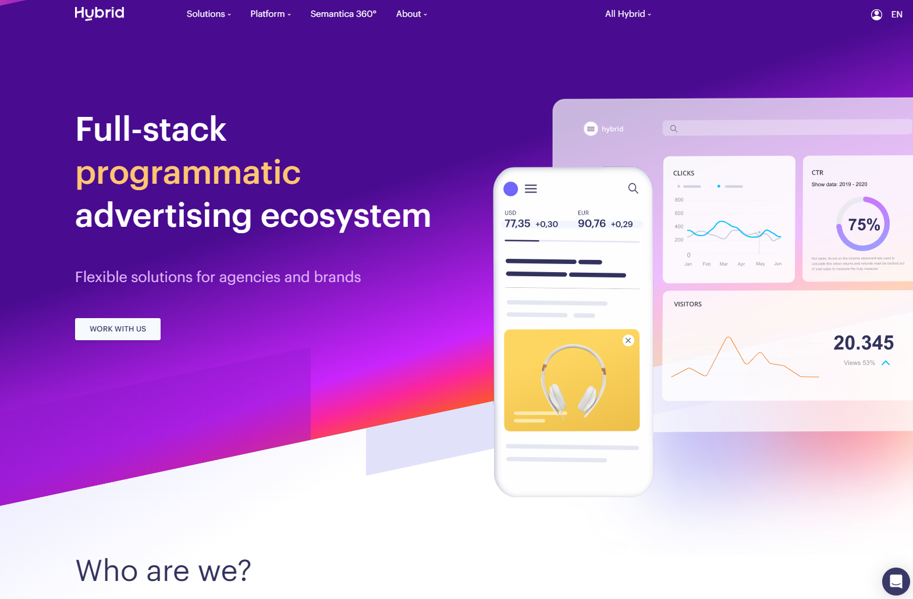
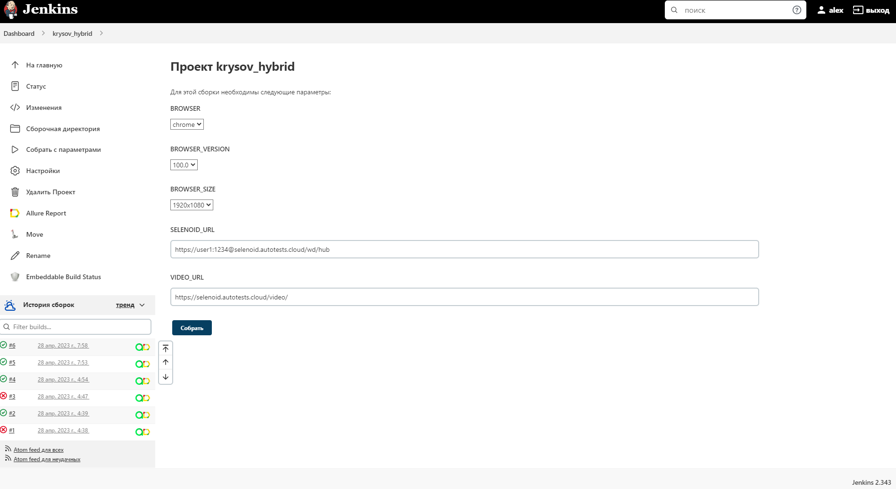
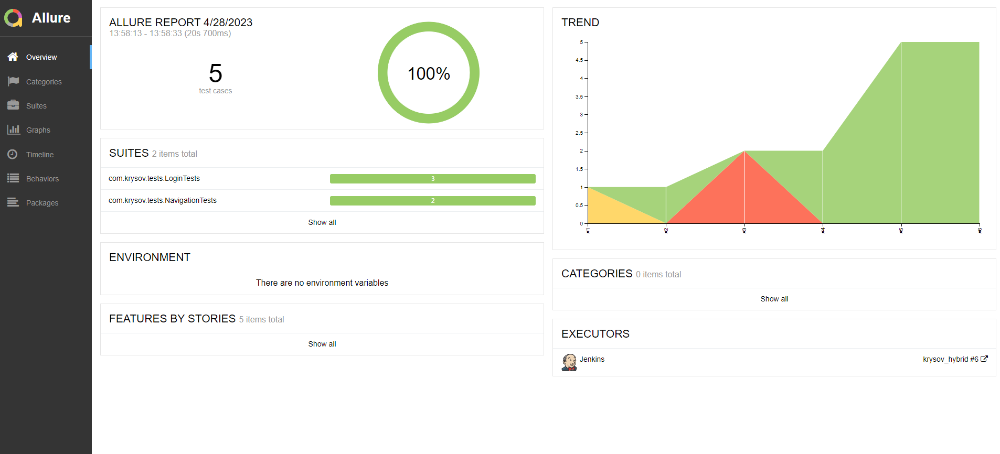
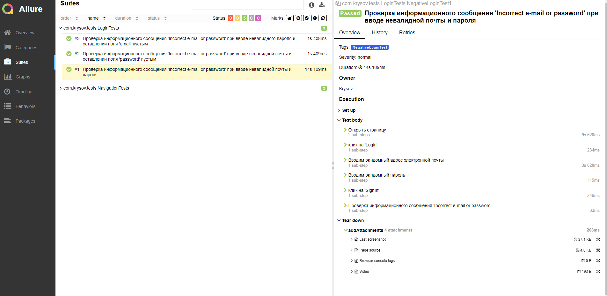
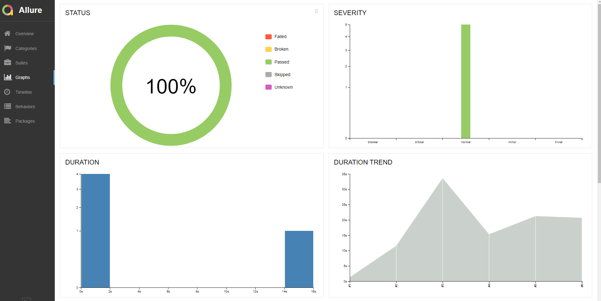
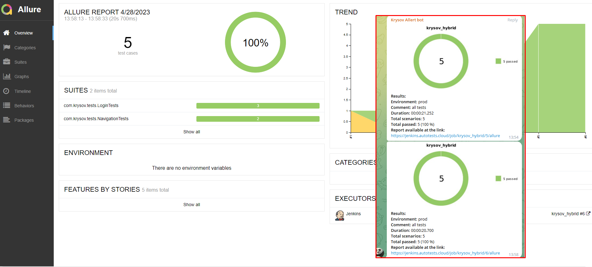
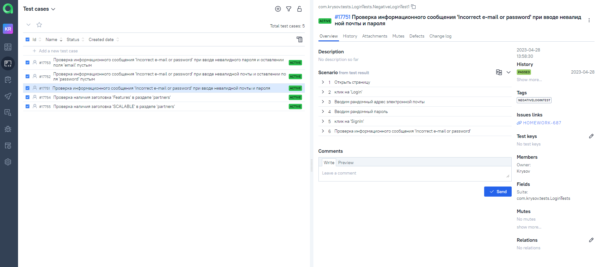
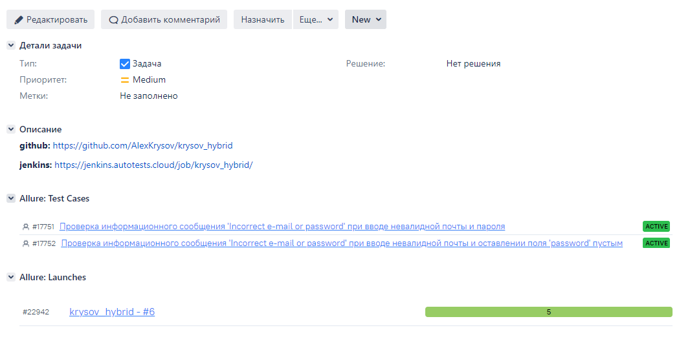

# Проект по автоматизации сайта  [hybrid](https://hybrid.ai/)
&nbsp;

&nbsp;

## 🧰: Технологии и инструменты

## 🚀: Реализованные проверки

#### Примеры автоматизированных кейсов:

Тест 1

- ✓ _Переход на сайт hybrid_
- ✓ _Клик на 'Login'_
- ✓ _Вводим рандомную, невалидную почту_
- ✓ _Вводим рандомныйб невалидный пароль_
- ✓ _Клик на 'SignIn'_
- ✓ _Проверка информационного сообщения 'Incorrect e-mail or password'_

Тест 2

- ✓ _Переход на сайт hybrid_
- ✓ _Навести курсор на 'platform'_
- ✓ _Клик на 'partners'_
- ✓ _Проверка заголовка 'Features'_

## </a> Jenkins <a target="_blank" href="https://jenkins.autotests.cloud/job/krysov_hybrid/"> job </a>

### 🧙: Параметры сборки в Jenkins:

:yum: Browser (браузер, по умолчанию chrome)

:zany_face: Version (версия браузера, по умолчанию 100.0)

:smirk: Browser_size (размер окна браузера, по умолчанию 1920x1080)

:relieved: URL (выбор url для теста)

:woozy_face: REMOTE_DRIVER_URL (адрес удалённого драйвера)

## 🏗️: Для запуска тестов из терминала необходимо заполнить junit-platform.properties или передать значение:

:one: URL - (выбор url)

:two: BROWSER - (выбор браузера)

:three: BROWSERSIZE - (выбор размера окна браузера)

:four: VERSION - (выбор версии браузера)

:five: REMOTE_DRIVER_URL - (выбор удалённого драйвера)

:seven: ALLURE_NOTIFICATIONS_VERSION - (выбор версии allure)

## </a> Отчет в <a target="_blank" href="https://jenkins.autotests.cloud/job/krysov_hybrid/6/allure/#">Allure report</a>

## ⛅: Overview

## 🧪: Suites

## 💹: Graphs

## </a> Интеграция уведомлений с <a target="_blank" href="https://t.me/autotestsKrysov/67">Telegram</a>

## </a> Интеграция с <a target="_blank" href="https://allure.autotests.cloud/project/2217/dashboards">Allure TestOps</a>

## </a> Интеграция с <a target="_blank" href="https://jira.autotests.cloud/browse/HOMEWORK-687">Jira</a>

## </a> Запись видео из Selenoid при прохождении автотеста:
